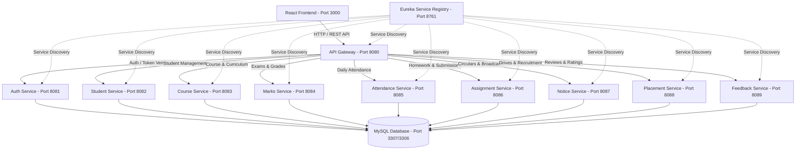

# 🎓 C-DAC Student Management System (SMS)

A modern, full-stack, cloud-native **Student Management System** built with **Spring Boot Microservices**, **Spring Cloud (Eureka & API Gateway)**, **MySQL**, and a **React.js** responsive frontend. Designed specifically to handle institute workflows including academic grading, attendance, assignment submissions, notices, placements, and faculty feedback.

---

## 📌 Badges & Tech Stack


---

## 🏛 Architecture Overview

The system is built on a **Microservices Architecture** where each domain is decoupled into dedicated, independently deployable services registered on **Netflix Eureka** and accessible via **Spring Cloud API Gateway**.



---

## 🚀 Microservices & Port Mapping

| Service Name | Port | Description |
| :--- | :---: | :--- |
| **Eureka Service Registry** | `8761` | Service discovery and registration server |
| **API Gateway** | `8080` | Central entry point, reverse proxy, routing & CORS handler |
| **Auth Service** | `8081` | User registration, login, role validation & JWT generation |
| **Student Service** | `8082` | Student profile management, batch info & personal details |
| **Course Service** | `8083` | Course catalog, modules, subjects, and curriculum details |
| **Marks Service** | `8084` | Module-wise marks, lab evaluations, CCEE exams & grade reports |
| **Attendance Service** | `8085` | Daily attendance logging, subject-wise percentage & statistics |
| **Assignment Service** | `8086` | Assignment publishing, student file submissions & grading |
| **Notice Service** | `8087` | Institute broadcast announcements, circulars & notifications |
| **Placement Service** | `8088` | Campus placement drives, company criteria & application tracking |
| **Feedback Service** | `8089` | Faculty evaluation, course feedback & rating analytics |
| **React Frontend** | `3000` | Single Page Application (SPA) with responsive dashboards |
| **MySQL Database** | `3307` | Central relational database (mapped to 3306 in Docker) |

---

## ✨ Features by Role

### 👨‍🎓 Student Portal
- **Dashboard**: Real-time overview of attendance percentage, pending assignments, upcoming exams, and recent announcements.
- **Profile**: View and manage personal information, PRN/Roll number, batch, and contact details.
- **Attendance**: Detailed breakdown of subject-wise attendance with warning indicators for low percentages.
- **Marks & Grades**: Check internal marks, lab exams, and CCEE scorecards.
- **Assignments**: View assignments, download problem statements, and submit solutions before deadlines.
- **Notices**: Access campus circulars, holiday calendars, and academic updates.
- **Placements**: Browse upcoming company drives, check eligibility criteria, and submit applications.
- **Feedback**: Submit course and instructor feedback.

### 👨‍🏫 Staff / Faculty Portal
- **Dashboard**: Quick metrics on total students, pending evaluations, and recent notices.
- **Student Directory**: Search, filter, and view student records across modules and batches.
- **Attendance Management**: Mark and update daily student attendance with automated percentage calculation.
- **Marks Evaluation**: Enter and update internal assessments, lab test scores, and final grades.
- **Assignment Hub**: Create assignments with deadlines, evaluate student submissions, and assign scores.
- **Notice Management**: Draft and publish institute-wide or batch-specific circulars.
- **Placement Coordination**: Post company drive details, set eligibility criteria, and track applicant lists.
- **Feedback Analytics**: Review student ratings and feedback reports.

---

## 🛠 Tech Stack Details

### Backend
- **Language**: Java 17
- **Framework**: Spring Boot 3.2.4
- **Spring Cloud**: 2023.0.0 (Netflix Eureka Discovery, Spring Cloud Gateway)
- **Security**: Spring Security + JWT (`io.jsonwebtoken:jjwt:0.11.5`)
- **Persistence**: Spring Data JPA (Hibernate ORM)
- **Build Tool**: Apache Maven (Multi-module parent POM)
- **Database**: MySQL 8.0

### Frontend
- **Framework**: React.js 18 (SPA)
- **Routing**: React Router DOM v6
- **Icons & UI**: Lucide React, React Icons
- **HTTP Client**: Axios (configured with interceptors for JWT auth)

---

## 📂 Project Structure

```plaintext
Cdac-Student-management-system/
├── backend/
│   ├── pom.xml                     # Parent Maven Project descriptor
│   ├── service-registry/           # Eureka Server (Port 8761)
│   ├── api-gateway/                # Spring Cloud Gateway (Port 8080)
│   ├── auth-service/               # JWT Authentication & Authorization (Port 8081)
│   ├── student-service/            # Student Management (Port 8082)
│   ├── course-service/             # Course & Curriculum Management (Port 8083)
│   ├── marks-service/              # Exam & Marks Management (Port 8084)
│   ├── attendance-service/         # Attendance Tracking (Port 8085)
│   ├── assignment-service/         # Assignment & Submissions (Port 8086)
│   ├── notice-service/             # Circulars & Notices (Port 8087)
│   ├── placement-service/          # Placement Drives (Port 8088)
│   └── feedback-service/           # Feedback & Ratings (Port 8089)
│
├── Cdac-Student-management-system-main/ # React Frontend Application (Port 3000)
│   ├── src/
│   │   ├── components/             # Reusable UI components
│   │   ├── pages/                  # Student & Staff dashboard pages
│   │   │   ├── staff/              # Staff management pages
│   │   │   ├── student/            # Student portal pages
│   │   │   ├── Login.jsx           # User Login
│   │   │   └── Register.jsx        # Registration
│   │   └── services/               # API service integration & mock data
│   └── package.json
│
├── docker-compose.yml              # Complete container orchestration setup
└── README.md
```

---

## ⚙️ Setup & Installation Guide

### Prerequisites
Make sure you have the following installed:
- [Git](https://git-scm.com/)
- [Java Development Kit (JDK 17 or higher)](https://www.oracle.com/java/technologies/downloads/#java17)
- [Node.js (v18 or higher)](https://nodejs.org/) & npm
- [Maven](https://maven.apache.org/) (optional if using `mvnw`)
- [Docker & Docker Compose](https://www.docker.com/) (Recommended for quick deployment)
- [MySQL 8.0](https://www.mysql.com/) (if running locally without Docker)

---

### Option 1: Run with Docker Compose (Recommended)

1. **Clone the repository:**
   ```bash
   git clone https://github.com/Devendra8625/Cdac-Student-management-system.git
   cd Cdac-Student-management-system
   ```

2. **Start all services with Docker Compose:**
   ```bash
   docker-compose up --build
   ```

3. **Access the application:**
   - **Frontend App**: [http://localhost:3000](http://localhost:3000)
   - **Eureka Dashboard**: [http://localhost:8761](http://localhost:8761)
   - **API Gateway**: [http://localhost:8080](http://localhost:8080)

---

### Option 2: Run Manually (Local Development)

#### 1. Setup Database
Ensure MySQL is running on port `3306` (or update database properties in `application.properties`):
```sql
CREATE DATABASE IF NOT EXISTS cdac_sms_db;
```

#### 2. Start the Backend Microservices (In Order)
Navigate to the `backend/` directory and run each service:

```bash
# Step 1: Start Eureka Discovery Server
cd backend/service-registry
mvn spring-boot:run

# Step 2: Start API Gateway
cd ../api-gateway
mvn spring-boot:run

# Step 3: Start Auth Microservice
cd ../auth-service
mvn spring-boot:run

# Step 4: Start remaining domain microservices
# (student-service, course-service, marks-service, attendance-service,
#  assignment-service, notice-service, placement-service, feedback-service)
```

#### 3. Start Frontend Application
```bash
cd Cdac-Student-management-system-main
npm install
npm start
```
The React frontend will start on [http://localhost:3000](http://localhost:3000).

---

## 🔐 API Gateway Routing Matrix

All client HTTP requests should be routed through the API Gateway at `http://localhost:8080`:

| Request Path | Routed Microservice |
| :--- | :--- |
| `/auth/**` | `AUTH-SERVICE` |
| `/api/students/**` | `STUDENT-SERVICE` |
| `/api/courses/**` | `COURSE-SERVICE` |
| `/api/marks/**` | `MARKS-SERVICE` |
| `/api/attendance/**` | `ATTENDANCE-SERVICE` |
| `/api/assignments/**` | `ASSIGNMENT-SERVICE` |
| `/api/notices/**` | `NOTICE-SERVICE` |
| `/api/placements/**` | `PLACEMENT-SERVICE` |
| `/api/feedback/**` | `FEEDBACK-SERVICE` |

---

## 👥 Contributors

- **Devendra** ([@Devendra8625](https://github.com/Devendra8625))

---

## 📄 License

This project is licensed under the [MIT License](LICENSE) - see the LICENSE file for details.
